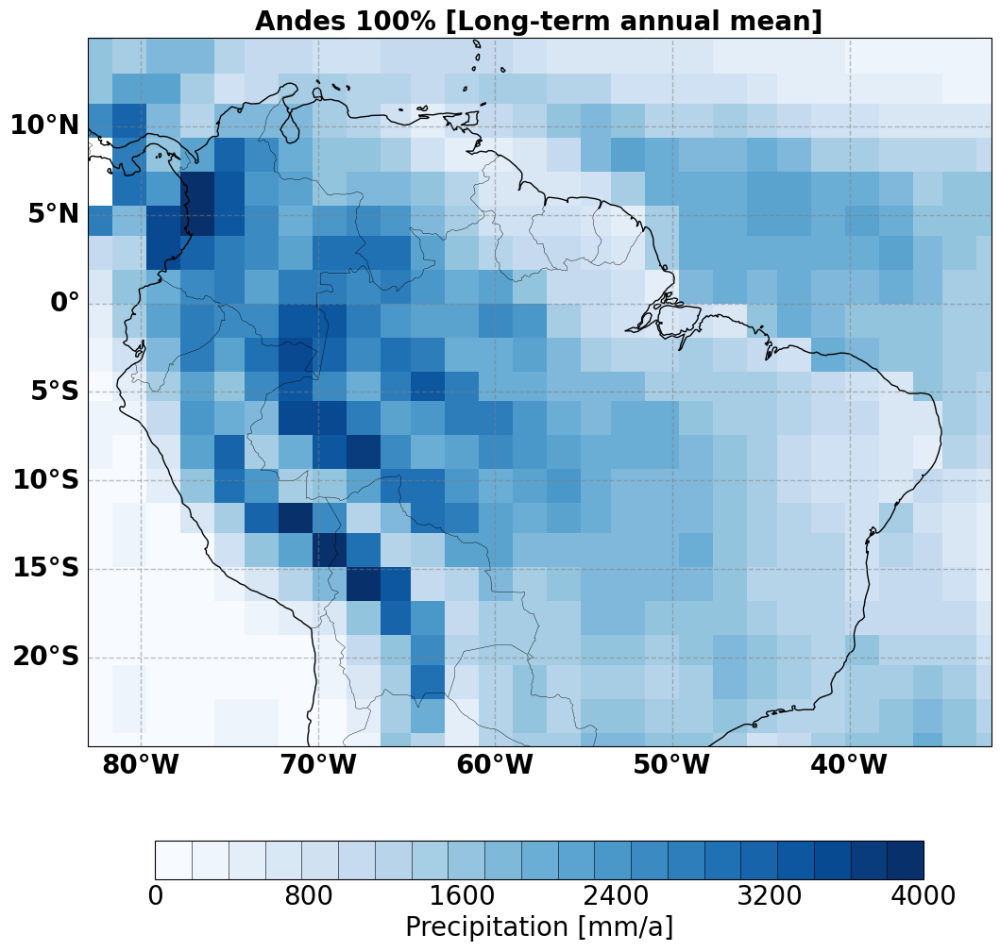

<h1 align="center">Welcome to REAME pyClimat 👋</h1>

</h1>

pyClimat is a python package for analysising GCM model output and visualization. The package is written in a function based 
(which would be pivoted to OPP style in future development). The [analysis](./pyClimat/analysis.py) module features climate variable extraction 
and estimation of statistical long-term means and difference. Statistical tools like PCA or EOF analysis are included for specific 
estimates and many other classical methods like testing, OLS estiates, etc. 

## installation 

The easy way to install is with `pip install pyClimat` (but would require some dependencies)
The following packages must be installed in your environment : **cartopy** and **xarray**. If you failed to compile this in your environment,
kindy raise an issue on that so I rebuild the distro for all systems if is not working. 
The stable verison should work on UNIX platforms for now

Alternatively, the package can be installed in **editing** mode with _**-e**_ flag in edit mode

## Documentation 

The [docs](./docs/) folder contains all the distribution files for the documentation compilation: 

 `cd docs | make html` to update the doc files

The direct stable link would be shared shortly (when a stable version of the package is released)

## Examples

This package was adopted for all the visualization in the research study by Boateng et. al 2022 ( **Impacts of surface uplift on regional climate**, which is currently under review for publication in the Climate of the Past journal). The scripts specifically for that study are compiled in the [Alps](./examples/Alps/) folder.

#### Gallery 
- Andes precipitation for PreIndustrial time: can be adapted from the this [script](./examples/Andes/mean_annual_plots.py)

- Oxygen isotope in precipitatiom comparsion plot

### Package structure 
- _**pyclimat.data**_ loads the climate model output (mostly the long-term means), however, xarray.open_dataset can be used to read data and use the other utilities
- _**pyclimat.analysis**_ is used for data analysis such as means, anomalies, EOF analysis and extraction of some section of the data 
- _**pyclimat.plot**_ features many plotting functionalities such as spatial maps, profiles and scatter points (check the examples or the associated research papers for more hints)

### To do 
- Structure the modules in classes for easy scripting 
- Update the documentation for all the functions 
- Add more ploting styles and examples
- Extend the functions to use **Basemap** and **pyGMT**

- ⚡ Fun fact **Happy coding and contact me if you have issues with the package**

(c) Boateng Daniel
